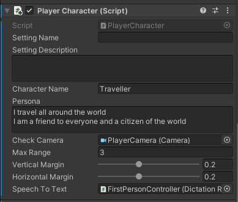

This tutorial shows how to use NPC Engine higher level components as well as how to integrate them into the classic NPC design. 

## Overview 

### Dependencies

This scene depends on a these free packages:

- [Modular First Person Controller](https://assetstore.unity.com/packages/3d/characters/modular-first-person-controller-189884) 
    is a player controller we are using. You can replace it with your own player controller including VR rigs. 
    [Custom Player Rig](#player-character) section explains how to do it. 
- [VIDE dialogues](https://assetstore.unity.com/packages/tools/ai/vide-dialogues-69932) 
    is a free dialogue tree implementation. This scene has an example integration for this dialogue system.
- [Low Poly Modular Armours](https://assetstore.unity.com/packages/3d/characters/lowpoly-modular-armors-free-pack-199890) is used for character models.
- [RPG Poly Pack - Lite](https://assetstore.unity.com/packages/3d/environments/landscapes/rpg-poly-pack-lite-148410) is used for the scene itself.

### Scene

This scene is located in `NPCEngine/Demo/AdvancedDemo` folder.

It contains 7 different characters with their own personas and names. 
Two of them have their own dialogue trees, two share the same dialogue tree 
and three do not have any dialogue trees assigned. Its a good example of how to use NPC Engine to fill the scene with NPCs.

To start the dialogue approach the character and start talking into your microphone.

!!! note "If you are using DictationRecognizerTTS (default option)."
    Dictation recognizer is currently functional only on Windows 10, and requires that dictation is permitted in the user's Speech privacy policy (Settings->Privacy->Speech, inking & typing). If dictation is not enabled, DictationRecognizerTTS will fail on Start. Developers can handle this failure in an app-specific way by providing a OnSpeechRecognitionFailed delegate.

## Components

### Player Character

To integrate player controller into NPC Engine, you need to add two components to your player controller:

- `NPCEngine.Components.PlayerCharacter`: This is the main component that is responsible for the player's location, persona and ability to initiate dialogue.  
It should be attached to the gameobject that has `player` tagged collider so that `ColliderLocationTrigger` script works correctly.
You should assign your player's camera to the `CheckCamera` field, It's used to check if player is looking at the NPC before initiating dialogue.
You should also enter name and a persona of your player character.
`MaxRange` is the minimum distance from the player to the NPC at which dialogue can be happening (dialogue is terminated if player is farther than this).
`Vertical/HorizontalMargin` controls how centered should NPC be in the camera to initiate dialogue. 
Setting(Location) name and description are set by `ColliderLocationTrigger` script when player enters the location trigger.

- `NPCEngine.Components.AbstractSpeechToText`: This is the component that is responsible for the speech recognition.
There are two implementations of this component available and they are discussed in the next section. 
By default, it's best to use `NPCEngine.Components.DictatinRecognizerSTT` which uses `UnityEngine.Windows.Speech.DictationRecognizer` and provides the best quality.

Here is the player character attached to the scene's player controller as an example:

### Speech Recognition

There are two implementations of speech recognition available:

- `NPCEngine.Components.DictatinRecognizerSTT`  
    It uses `UnityEngine.Windows.Speech.DictationRecognizer`.  
    It's downside are:
    - It requires additional permissions to be enabled in the user's privacy settings. 
    - It has relatively high latency.
    - It doesn't work when application is not in focus.
    - It's hard to diagnose if something goes wrong. (e.g. speech is not recognized)  

But it does provide the best quality of recognition.

- `NPCEngine.Components.NPCEngineSTT`  
    It uses NPCEngine's own speech recognition engine.  
    It does not require additional permissions and has low latency, 
    but it's work in progress and the quality is much worse than `NPCEngine.Components.DictatinRecognizerSTT`.
    It requires speech to be very clear and understandable as well as low noise environment.
    It also can be quite confusing for the chatbots when it does not recognize speech properly.

Advanced demo scene uses `DictatinRecognizerSTT` by default, but you can try `NPCEngineSTT` just by replacing components in `FirstPersonController` gameobject.

### CollisionLocationTrigger

If your game has a lot of locations, you can use this component to make it easier to assign location names and descriptions to your player character.
Just place a trigger collider to cover the location and add this component to it. Otherwise you could just provide default location name and description in the `PlayerCharacter` component.

### Non-Player Character

To integrate NPC into NPC Engine, you need to:

- Implement `NPCEngine.Components.AbstractDialogueSystem`. It's already done for VIDE dialogue system in the demo scene
in `NPCEngine/Demo/AdvancedDemo/Scripts` folder.
Refer to [VIDE Asset Store page](https://assetstore.unity.com/packages/tools/ai/vide-dialogues-69932) for more details about this dialogue system.
- Add `NPCEngine.Components.AbstractDialogueSystem` and `NPCEngine.Components.NonPlayerCharacter` component to your NPC.

#### NPCEngine.Components.NonPlayerCharacter

This component uses speech recognized by `PlayerCharacter` to navigate dialogue trees, 
generate replies and emit dialogue related events.

The high level flow of the dialogue is as follows:

- First, the type of the node is checked, if it's an NPC node, then the speech is generated and OnDialogueLine event is emitted.
It repeats this process until a player node is found.
- When a player node is found, component signals PlayerCharacter to recognize more speech.
- When speech is recognized, OnDialogueLine event is emitted again for the player line, 
topics are requested from the dialogue system and OnTopicHintsUpdate is emitted.
- Player line is matched via semantic similarity to the player options in the dialogue tree.
- If the player line is matched to one of the options it is selected in the dialogue tree and AbstractDialogueSystem.Next() is called, 
otherwise reply is generated by the ChatbotAPI.
- All the steps are repeated until the dialogue is finished.

So as you can see you design your dialogue tree in the same way as you would without NPC Engine 
and everything else will be handled by the chatbot neural net.

The most important fields of this component should sound familiar for you if you've tried BasicDemo scene already.
Here is the short description of those:

##### characterName and persona

These are the name and persona of the NPC used to generate lines via chatbot neural network.

##### topK and temperature

These are sampling parameters for the chatbot neural network. 
It was finetuned for the `temperature` == 1.0, so it's best to keep it that way. 
Randomness of the output can be controlled via `topK` parameter.

##### defaultThreshold

This is the default semantic similarity threshold that triggers dialogue options.
You can also specify it in the dialogue system. In case of VIDE it can be added as extraVars to the dialogue node.

##### voiceId and nChunksTextGeneration

These are the parameters for TextToSpeech generation. VoiceId is the voice used to generate the text. nChunksTextGeneration is the number of chunks in which speech will be generated. In short, nChunksTextGeneration is a tradeof between quality and latency where 1 is the best quality and the most latency. Recommended range is [1, 10].

##### audioSourceQueue

It's a reference to the script that handles audio playback from the iterative speech generation.

##### dialogueSystem

It's a reference to the implementation of the AbstractDialogueSystem that is used to generate dialogue.

##### Events

They are pretty self-explanatory and are useful for all the presentation functionality (e.g. dialogue UI and animations).

#### VIDEDialogueSystem

This is the implementation of the AbstractDialogueSystem for the VIDE dialogues.
Only a few things are different from the default usage of VIDE:

- You can specify topics in the line string by using square brackets in the beginning of the line (e.g. `[Tavern] Where is the tavern?`).
- OnTopicHintsUpdate event receives only unique topics as an argument so you can specify same topic for multiple lines
- If no topic is specified then the line is taken as a topic. You can set topic to empty via empty brackets.  
e.g. 
- You can specify threshold for the node via Extra Variable with the name `threshold`.  
e.g. 

##### Dialogue Design Considerations

You can check scene's existing dialogues for examples of how to design dialogues.
Here are a few tips:

- Use multiple lines for each options to cover semantically distinct answers that in the context of the dialogue lead to similar results.  

!!! note "Example" 
    In context of accepting to help someone do something there are a few options that are not semantically similar:

    - `I will help you`
    - `I will do something`
    - `I'll figure something out`

    Would all mean the same thing in the context of the dialogue, but in isolation mean different things.
    Best way to design dialogues for NPC Engine is to continually playtest them and find missing options 
    that should be there as well as tune the thresholds to exclude anything unrelated.

- Start the dialogue via NPC node and use it to set the topic and the mood of the dialogue. 
It is the most reliable method to control what chatbot will generate.

!!! note "Example" 
    If the character is angry, then it's best to start the dialogue with NPC expressing this anger via cursing 
    or complaining about the object of his anger.

    If the character's village is attacked by goblins, then it's best to start the dialogue with a line that
    describes the situation and communicates distress.
